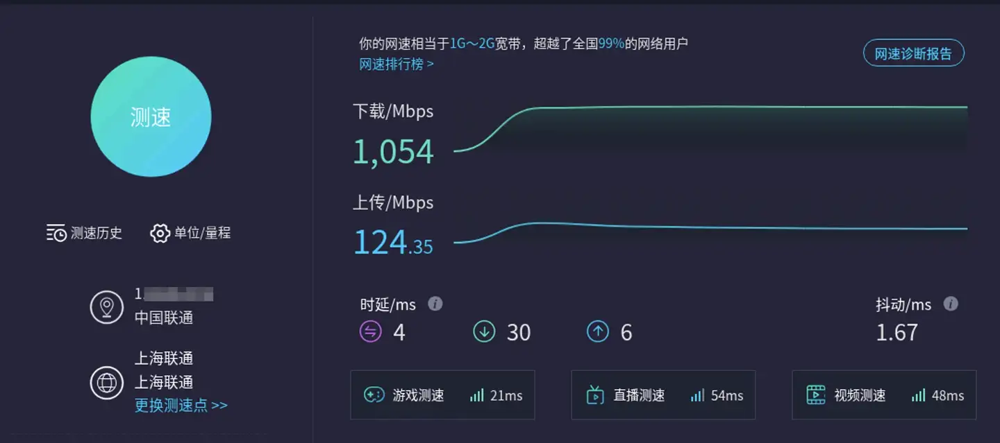
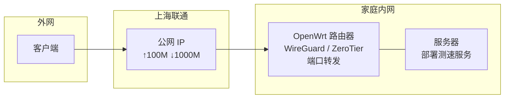
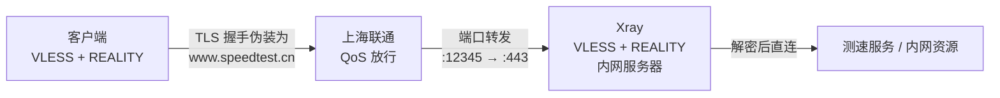
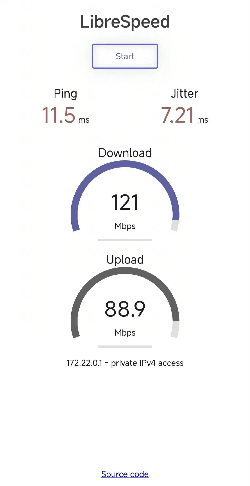

最近重新研究了一下怎么从外面访问家里的内网，目前的架构是这样的：

家里宽带是上海联通，有公网 IP，上行 100M，下行 1000M。路由器是 OpenWrt，部署了 ZeroTier 和 WireGuard；内网还有一台服务器，上面部署了测速服务。





之前使用 ZeroTier 作为回家工具，但是前段时间在外地出差发现使用体验极差，几乎处于不可用的状态。重新测了一下速：

| 链路 | Ping | ↓ 下行 | ↑ 上行 |
|:--|:--|:--|:--|
| 内网 → 测速服务 | — | 跑满 | 跑满 |
| 外网 → WireGuard（路由器）→ 测速服务 | 12.8ms | 0.67M | 4.57M |
| 外网 → ZeroTier（路由器）→ 测速服务 | 21.1ms | 22.4M | 23.4M |

无论怎么调整 MTU 和切换端口，WireGuard 的下行最多也只有 2–3M 的样子，还不如 ZeroTier。怀疑运营商对 WireGuard 的流量做了识别，于是放弃，又做了两个测试：

| 链路 | Ping | ↓ 下行 | ↑ 上行 |
|:--|:--|:--|:--|
| 外网 → 路由器端口转发 → Shadowsocks（服务器）→ 测速服务 | 11.7ms | 0.60M | 5.39M |
| 外网 → 路由器端口转发 → 测速服务（第一次） | 17.2ms | 99.7M | 9.5M |
| 外网 → 路由器端口转发 → 测速服务（再次测试） | 14.9ms | 1.21M | 19.5M |

Shadowsocks 的原因应该和 WireGuard 一样，流量太容易被识别了。

裸端口转发的结果很有意思：换一个全新端口测试就能回到百兆，但几次之后又会被制裁到 1M。

这个结果给了一个新的思路，全新端口的前几次请求能跑满上行上限，可能是被当成了测速流量。那如果我回家的流量全部伪装成测速网站的流量，是不是就能绕过运营商的 QoS 限制？

那有什么东西既能提供代理又能伪装流量呢？这就得从另一个领域里掏家伙了（虽然有点杀鸡用牛刀）

## 部署



服务器上部署 `docker-compose.yml`：

```yaml
services:
  xray:
    image: ghcr.io/xtls/xray-core:latest
    container_name: xray
    restart: unless-stopped
    ports:
      - "12345:443/tcp"
    volumes:
      - ./etc/:/usr/local/etc/xray/:ro
```

`config.json`：

```json
{
  "log": {
    "loglevel": "warning"
  },
  "inbounds": [
    {
      "listen": "0.0.0.0",
      "port": 443,
      "protocol": "vless",
      "settings": {
        "clients": [
          {
            "id": "f*******5"
          }
        ],
        "decryption": "none"
      },
      "streamSettings": {
        "network": "tcp",
        "security": "reality",
        "realitySettings": {
          "dest": "www.speedtest.cn:443",
          "serverNames": [
            "www.speedtest.cn"
          ],
          "privateKey": "g********4",
          "shortIds": [
            "",
            "abcd1234"
          ]
        }
      },
      "sniffing": {
        "enabled": true,
        "destOverride": [
          "http",
          "tls",
          "quic"
        ]
      }
    }
  ],
  "outbounds": [
    {
      "protocol": "freedom",
      "tag": "direct"
    },
    {
      "protocol": "blackhole",
      "tag": "block"
    }
  ]
}
```

把回家的流量伪装成测速网站，测试发现：

| 链路 | Ping | ↓ 下行 | ↑ 上行 |
|:--|:--|:--|:--|
| 外网 → 路由器端口转发 → Xray（服务器）→ 测速服务 | 7.40ms | 121M | 88.9M |



----

# History

|Version| Action|Time|
|:-------:|:--------:|:-----------:|
|1.0|init|2026-09-03 16:32:16|
