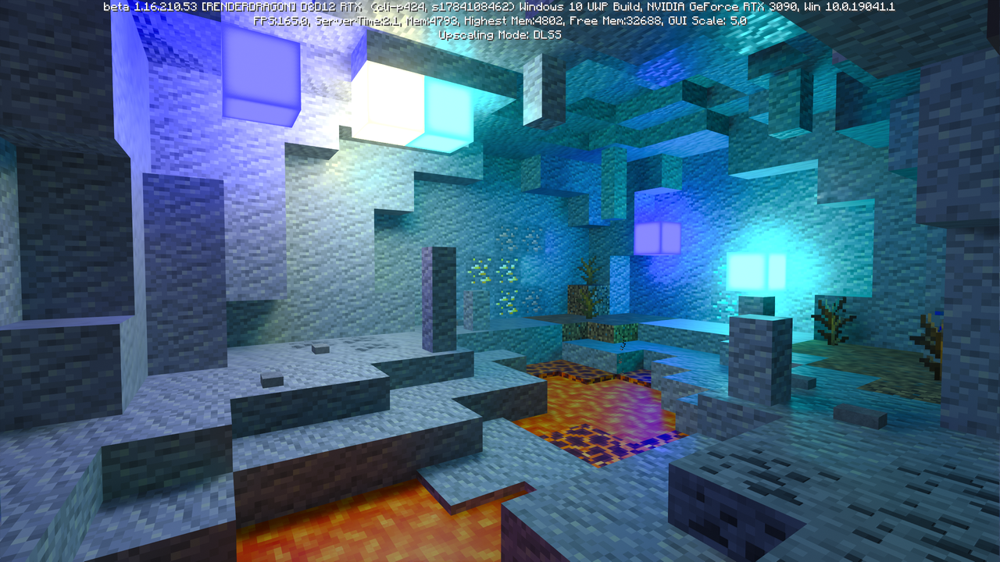

# 标题

```md
# 一级标题
## 二级标题
### 三级标题
#### 四级标题
##### 五级标题
###### 六级标题

这也是一个一级标题
============================

这也是一个二级标题
--------------------------------------------------

正文
```

# 一级标题
## 二级标题
### 三级标题
#### 四级标题
##### 五级标题
###### 六级标题

这也是一个一级标题
============================

这也是一个二级标题
--------------------------------------------------

正文


# 换行

## 末尾使用一个换行

```md
第一行
第二行
第三行
```

第一行
第二行
第三行

## 末尾使用两个空格和一个换行

```md
第一行  
第二行  
第三行
```

第一行  
第二行  
第三行

## 末尾使用两个换行

```md
第一行

第二行

第三行
```

第一行

第二行

第三行


# 字体

```md
_斜体文本_ *斜体文本*  
**粗体文本** ***粗斜体文本***  
~~带删除线的文本~~ <u>带下划线的文本</u>
```

_斜体文本_ *斜体文本*  
**粗体文本** ***粗斜体文本***  
~~带删除线的文本~~ <u>带下划线的文本</u>

# 分隔线

```md
***
或者
----
```

***

# 脚注

```md
创建脚注格式类似这样 [^1].

[^1]: [这里是脚注示例.](https://www.google.com)
```

创建脚注格式类似这样 [^1].

[^1]: [这里是脚注示例.](https://www.google.com)

# 列表

## 无序列表

无序列表标记可以使用 `-`, `*` 或 `+`, 但同一个列表中必须使用一致的标记.

```md
- 第一项
- 第二项
- 第三项

```

- 第一项
- 第二项
- 第三项

```md
* 第 2 部分
  * 第 2.1 章
    * 第 2.1.1 节
  * 第 2.2 章
```

* 第 2 部分
  * 第 2.1 章
    * 第 2.1.1 节
  * 第 2.2 章

## 有序列表

```md
1. 第一项
1. 第二项
1. 第三项
```

1. 第一项
2. 第二项
3. 第三项

```md
1. 第一项：
    1. 第一项嵌套的第一个元素
    1. 第一项嵌套的第二个元素
1. 第二项：
    - 第二项嵌套的第一个元素
    - 第二项嵌套的第二个元素
```

1. 第一项：
    1. 第一项嵌套的第一个元素
    1. 第一项嵌套的第二个元素
1. 第二项：
    - 第二项嵌套的第一个元素
    - 第二项嵌套的第二个元素

# 区块引用

```md
> 其实我不知道我为什么喜欢你，真的不知道，但是跟你在一起就会莫名的开心。如果我说我喜欢你俊美的样子，那等哪天你成了黄脸婆，我不知道要把你放在哪里。如果我说我喜欢你曼妙的身材，那等哪天你成了水桶腰，我不知道要把你放在哪里。如果我说我喜欢你温柔贤惠，那等哪天你到了更年期变得喜怒无常，我不知道要把你放在哪里。  
> 我真的不知道为什么喜欢你，也许就是因为不知道为什么，我为你做的每一件事才会那么坚定，才会那么义无反顾。如果以后有一天我找到了爱你的原因，我会告诉自己，我没有爱错你，当初的义无反顾也并非心血来潮，我会抱紧你，直到死去。
```

> 其实我不知道我为什么喜欢你，真的不知道，但是跟你在一起就会莫名的开心。如果我说我喜欢你俊美的样子，那等哪天你成了黄脸婆，我不知道要把你放在哪里。如果我说我喜欢你曼妙的身材，那等哪天你成了水桶腰，我不知道要把你放在哪里。如果我说我喜欢你温柔贤惠，那等哪天你到了更年期变得喜怒无常，我不知道要把你放在哪里。  
> 我真的不知道为什么喜欢你，也许就是因为不知道为什么，我为你做的每一件事才会那么坚定，才会那么义无反顾。如果以后有一天我找到了爱你的原因，我会告诉自己，我没有爱错你，当初的义无反顾也并非心血来潮，我会抱紧你，直到死去。

# 代码

## 行内代码

```md
我们可以在控制台使用 `console.log()` 函数.
```

我们可以在控制台使用 `console.log()` 函数.

## 块代码

```c
float Q_rsqrt( float number )
{
  long i;
  float x2, y;
  const float threehalfs = 1.5F;

  x2 = number * 0.5F;
  y  = number;
  i  = * ( long * ) &y;                       // evil floating point bit level hacking
  i  = 0x5f3759df - ( i >> 1 );               // what the fuck?
  y  = * ( float * ) &i;
  y  = y * ( threehalfs - ( x2 * y * y ) );   // 1st iteration
//      y  = y * ( threehalfs - ( x2 * y * y ) );   // 2nd iteration, this can be removed

  return y;
}
```

这是一个普通代码块。

```c title="Q_sort.c" magic number" {3, 4} /0x5f3759df/
float Q_rsqrt( float number )
{
  long i;
  float x2, y;
  const float threehalfs = 1.5F;

  x2 = number * 0.5F;
  y  = number;
  i  = * ( long * ) &y;                       // evil floating point bit level hacking
  i  = 0x5f3759df - ( i >> 1 );               // what the fuck?
  y  = * ( float * ) &i;
  y  = y * ( threehalfs - ( x2 * y * y ) );   // 1st iteration
//      y  = y * ( threehalfs - ( x2 * y * y ) );   // 2nd iteration, this can be removed

  return y;
}
```

上面是添加了文件名和一些高亮信息的代码块。

```c caption="Q_Sort magic number" {3, 4} /0x5f3759df/
float Q_rsqrt( float number )
{
  long i;
  float x2, y;
  const float threehalfs = 1.5F;

  x2 = number * 0.5F;
  y  = number;
  i  = * ( long * ) &y;                       // evil floating point bit level hacking
  i  = 0x5f3759df - ( i >> 1 );               // what the fuck?
  y  = * ( float * ) &i;
  y  = y * ( threehalfs - ( x2 * y * y ) );   // 1st iteration
//      y  = y * ( threehalfs - ( x2 * y * y ) );   // 2nd iteration, this can be removed

  return y;
}
```

上面是一个添加了 Caption 信息的代码块。需要注意的是，虽然文件名与 Caption 可以同时使用，但是效果很丑，不建议这么使用。更多用法可以参考文档 [https://rehype-pretty-code.netlify.app/](https://rehype-pretty-code.netlify.app/).

# 链接

```md
这是一个链接 [Google](https://www.google.com).

链接也可以用变量来代替, 文档末尾附带变量地址:

  - 这个链接用 google 作为网址变量 [Google][google].
  - 这个链接用 tiktok 作为网址变量 [Tiktok][tiktok].

然后在文档的结尾为变量赋值 (网址).

[google]: http://www.google.com/
[tiktok]: http://www.tiktok.com/
```

这是一个链接 [Google](https://www.google.com).

链接也可以用变量来代替, 文档末尾附带变量地址:

  - 这个链接用 google 作为网址变量 [Google][google].
  - 这个链接用 tiktok 作为网址变量 [Tiktok][tiktok].

然后在文档的结尾为变量赋值 (网址).

[google]: http://www.google.com/
[tiktok]: http://www.tiktok.com/

# 图片

```md
行内图片测试。GIF：，小图片：，大图片：

不带标题的图片块测试：


带标题的图片块测试：


```

行内图片测试。GIF：，小图片：，大图片：

不带标题的图片块测试：


带标题的图片块测试：


# 表格

```md
| 这一列是左对齐 | 这一列是右对齐 | 这一列是居中对齐 |
|:--------|--------:|:--------:|
| 单元格     |     单元格 |   单元格    |
| 单元格     |     单元格 |   单元格    |
```
| 这一列是左对齐 | 这一列是右对齐 | 这一列是居中对齐 |
|:--------|--------:|:--------:|
| 单元格     |     单元格 |   单元格    |
| 单元格     |     单元格 |   单元格    |

```html
<table>
    <thead>
    <tr>
        <th rowSpan="2">值班人员</th>
        <th>星期一</th>
        <th>星期二</th>
        <th>星期三</th>
    </tr>
    </thead>
    <tbody>
        <tr>
            <td rowSpan="2">第一组</td>
            <td>李强</td>
            <td>张明</td>
            <td>王平</td>
        </tr>
        <tr>
            <td>李强</td>
            <td>张明</td>
            <td>王平</td>
        </tr>
        <tr>
          <td rowSpan="2">第二组</td>
          <td>李强</td>
          <td>张明</td>
          <td>王平</td>
        </tr>
        <tr>
          <td>李强</td>
          <td>张明</td>
          <td>王平</td>
        </tr>
    </tbody>
</table>
```

<table>
    <thead>
    <tr>
        <th rowSpan="2">值班人员</th>
        <th>星期一</th>
        <th>星期二</th>
        <th>星期三</th>
    </tr>
    </thead>
    <tbody>
        <tr>
            <td rowSpan="2">第一组</td>
            <td>李强</td>
            <td>张明</td>
            <td>王平</td>
        </tr>
        <tr>
            <td>李强</td>
            <td>张明</td>
            <td>王平</td>
        </tr>
        <tr>
          <td rowSpan="2">第二组</td>
          <td>李强</td>
          <td>张明</td>
          <td>王平</td>
        </tr>
        <tr>
          <td>李强</td>
          <td>张明</td>
          <td>王平</td>
        </tr>
    </tbody>
</table>

# 公式

```md
我们有 $\cos(\beta) = - \cfrac{\vec{v}\cdot\vec{n}}{||\vec{v}||||\vec{n}||} = - \vec{v}\cdot\vec{n}$. 那么 $\sin^2(\gamma)=n^2\sin^2{\beta}=(1- (\vec{v}\cdot\vec{n})^2)n^2$, $\cos^2(\gamma)=1-n^2\sin^2{\gamma}=1-(1- (\vec{v}\cdot\vec{n})^2)n^2$ 满足 $1-(1- (\vec{v}\cdot\vec{n})^2)n^2 \ge 0$ 时, 才会发生折射.

对于电介质而言, 有如下方程

$$
R_s=(\cfrac{\cos\theta_i-n\cos\theta_t}{\cos\theta_i+n\cos\theta_t})^2
$$

$$
R_p=(\cfrac{\cos\theta_t-n\cos\theta_i}{\cos\theta_t+n\cos\theta_i})^2
$$

$R_s$ 和 $R_p$ 分别表示入射光的 s 偏振和 p 偏振的反射比. 一般情况下, 不考虑偏振时, 我们认为入射光的反射比:

$$
R= \cfrac{R_s + R_p}{2}
$$


这个方程可以使用菲涅耳-施里克近似法进行近似:

$$
R(\theta) \approx R(0) + (1 - R(0))(1 - \cos(\theta_i))^5
$$

$$
\mathbf{V}_1 \times \mathbf{V}_2 =  \begin{vmatrix} 
\mathbf{i} & \mathbf{j} & \mathbf{k} \\
\cfrac{\partial X}{\partial u} &  \cfrac{\partial Y}{\partial u} & 0 \\
\cfrac{\partial X}{\partial v} &  \cfrac{\partial Y}{\partial v} & 0 \\
\end{vmatrix}
$$
```

我们有 $\cos(\beta) = - \cfrac{\vec{v}\cdot\vec{n}}{||\vec{v}||||\vec{n}||} = - \vec{v}\cdot\vec{n}$. 那么 $\sin^2(\gamma)=n^2\sin^2{\beta}=(1- (\vec{v}\cdot\vec{n})^2)n^2$, $\cos^2(\gamma)=1-n^2\sin^2{\gamma}=1-(1- (\vec{v}\cdot\vec{n})^2)n^2$ 满足 $1-(1- (\vec{v}\cdot\vec{n})^2)n^2 \ge 0$ 时, 才会发生折射.

对于电介质而言, 有如下方程

$$
R_s=(\cfrac{\cos\theta_i-n\cos\theta_t}{\cos\theta_i+n\cos\theta_t})^2
$$

$$
R_p=(\cfrac{\cos\theta_t-n\cos\theta_i}{\cos\theta_t+n\cos\theta_i})^2
$$

$R_s$ 和 $R_p$ 分别表示入射光的 s 偏振和 p 偏振的反射比. 一般情况下, 不考虑偏振时, 我们认为入射光的反射比:

$$
R= \cfrac{R_s + R_p}{2}
$$


这个方程可以使用菲涅耳-施里克近似法进行近似:

$$
R(\theta) \approx R(0) + (1 - R(0))(1 - \cos(\theta_i))^5
$$

$$
\mathbf{V}_1 \times \mathbf{V}_2 =  \begin{vmatrix} 
\mathbf{i} & \mathbf{j} & \mathbf{k} \\
\cfrac{\partial X}{\partial u} &  \cfrac{\partial Y}{\partial u} & 0 \\
\cfrac{\partial X}{\partial v} &  \cfrac{\partial Y}{\partial v} & 0 \\
\end{vmatrix}
$$

# Todo 列表

```md
- [ ] **Cmd Markdown 开发**
    - [ ] 改进 Cmd 渲染算法，使用局部渲染技术提高渲染效率
    - [ ] 支持以 PDF 格式导出文稿
    - [x] 新增Todo列表功能 [语法参考](https://github.com/blog/1375-task-lists-in-gfm-issues-pulls-comments)
    - [x] 改进 LaTex 功能
        - [x] 修复 LaTex 公式渲染问题
        - [x] 新增 LaTex 公式编号功能 [语法参考](http://docs.mathjax.org/en/latest/tex.html#tex-eq-numbers)
- [ ] **七月旅行准备**
    - [ ] 准备邮轮上需要携带的物品
    - [ ] 浏览日本免税店的物品
    - [x] 购买蓝宝石公主号七月一日的船票
```

- [ ] **Cmd Markdown 开发**
    - [ ] 改进 Cmd 渲染算法，使用局部渲染技术提高渲染效率
    - [ ] 支持以 PDF 格式导出文稿
    - [x] 新增Todo列表功能 [语法参考](https://github.com/blog/1375-task-lists-in-gfm-issues-pulls-comments)
    - [x] 改进 LaTex 功能
        - [x] 修复 LaTex 公式渲染问题
        - [x] 新增 LaTex 公式编号功能 [语法参考](http://docs.mathjax.org/en/latest/tex.html#tex-eq-numbers)
- [ ] **七月旅行准备**
    - [ ] 准备邮轮上需要携带的物品
    - [ ] 浏览日本免税店的物品
    - [x] 购买蓝宝石公主号七月一日的船票

# 按钮

使用 <kbd>Ctrl</kbd> + <kbd>Alt</kbd> + <kbd>Del</kbd> 重启电脑
